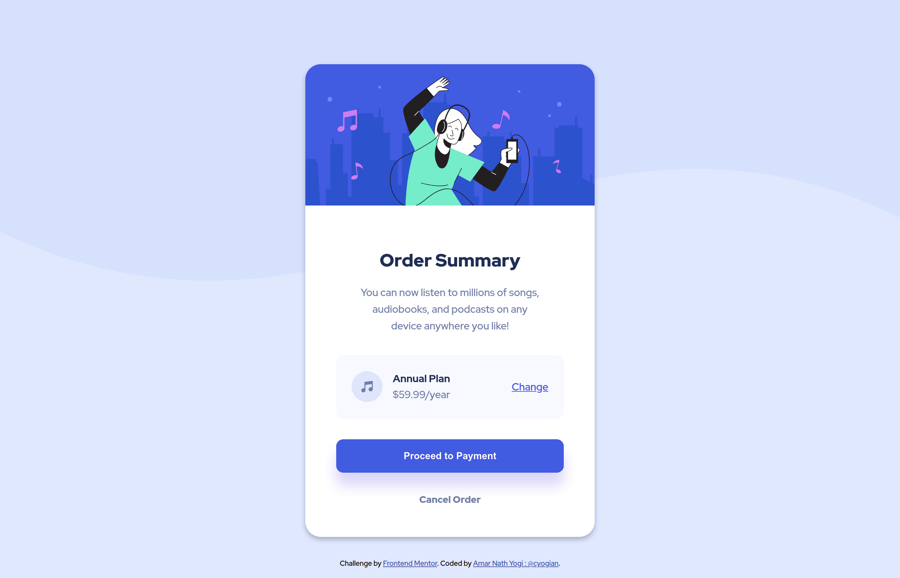

# Frontend Mentor - Order summary card solution

This is a solution to the [Order summary card challenge on Frontend Mentor](https://www.frontendmentor.io/challenges/order-summary-component-QlPmajDUj). Frontend Mentor challenges help you improve your coding skills by building realistic projects. 

## Table of contents

- [The challenge](#the-challenge)
- [Screenshot](#screenshot)
- [Links](#links)
- [Built with](#built-with)
- [What I learned](#what-i-learned)

### The challenge

Users should be able to:

- See hover states for interactive elements

### Screenshot

### Links

- Solution URL: [https://github.com/cyogian/fm-order-summary](https://github.com/cyogian/fm-order-summary)
- Live Site URL: [https://cyogian.github.io/fm-order-summary](https://cyogian.github.io/fm-order-summary)

### Built with

- Semantic HTML5 markup
- CSS custom properties
- Flexbox

### What I learned

- practiced my knowledge of flexbox
